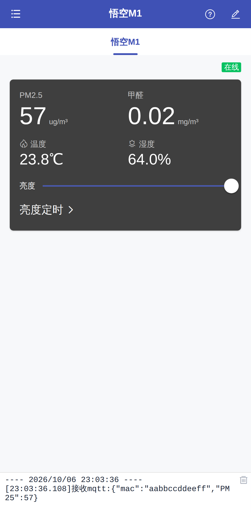
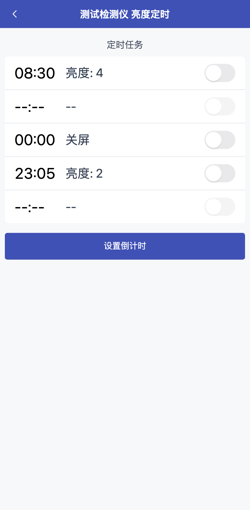
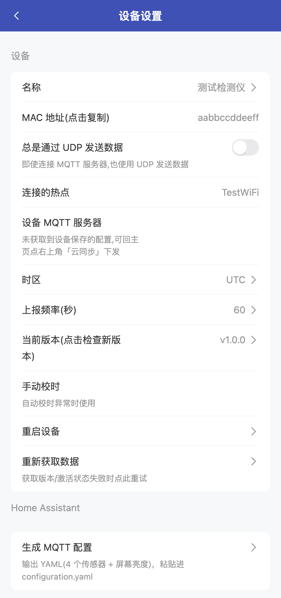

# zControl Web

**zM1 空气检测仪**（斐讯悟空 M1）的 Web 控制台：Node.js 后端 + Vue 前端，用浏览器管理设备，不需要装任何 App。

- 后端负责所有网络能力（MQTT 客户端、UDP 广播、局域网发现、持久化），前端只管界面。
- 支持 MQTT 与 UDP 两种通信通道，自动选择；MQTT 断线自动重连。
- 服务器常驻，页面刷新不丢设备状态。

## 功能

| 模块 | 内容 |
| --- | --- |
| 实时数据 | PM2.5、甲醛、温度、湿度、在线状态，实时推送 |
| 屏幕亮度 | 0（关屏）～4 档，滑动即下发 |
| 亮度定时 | 5 组定时任务（时间 + 动作 + 启用开关），含倒计时（占用第 5 组） |
| 设备设置 | 名称、MAC 复制、连接热点、时区（33 个时区）、上报频率、手动校时、重启、重新获取数据 |
| 固件升级 | 版本检查 + OTA 下发（含进度/成功/失败提示），也支持手动输入固件地址 |
| 设备管理 | 局域网扫描发现、手动输入 MAC 添加、改名、排序、删除、JSON 导入导出 |
| 通信配置 | MQTT 服务器/用户名/密码/ClientID 在服务端保存（密码不回传前端），可一键同步给设备 |
| 其它 | 设备日志面板（收发报文）、配网说明页 |

## 界面预览

<p align="center">
  
  
  
</p>

## 架构

```
浏览器（Vue 3 + Vant，移动端优先）
  ├─ REST  /api/*  ─┐
  └─ WS    /ws     ─┤
                    ▼
          后端（Fastify）
            ├── transport/mqtt      → MQTT broker：device/zm1/<mac>/{set,state,sensor,availability}
            ├── transport/udp       → 局域网 10181/10182 广播
            ├── transport/discovery → 设备探测（广播 + mDNS）
            ├── device/             → zM1 协议编解码 + 指令白名单校验
            ├── store/              → SQLite（设备表、全局设置、单设备设置）
            └── ws/                 → 实时推送给前端
```

生产模式下前端构建产物由后端托管，单端口访问。

## 快速开始

要求：Node.js ≥ 24（用到内置 `node:sqlite` 与原生 TypeScript 支持）、pnpm ≥ 10（本项目用 pnpm 12，见 `packageManager` 字段）。

```bash
pnpm install

# 开发：后端 :8090，前端 :5173（Vite 代理 /api 与 /ws）
pnpm dev

# 分开启动
pnpm --filter @zcontrol/server dev
pnpm --filter @zcontrol/web dev

# 生产：构建前端后由后端单端口托管
pnpm build && pnpm start        # 打开 http://<你的服务器地址>:8090
```

首次使用：打开界面 → 左侧抽屉「设置」→ 填 MQTT 服务器（`地址:端口`，如 `192.168.1.10:1883`）→
回到主界面点右上角云图标把配置同步给设备 → 抽屉「增加设备」扫描并添加设备。

### 环境变量

| 变量 | 默认 | 说明 |
| --- | --- | --- |
| `PORT` | `8090` | 后端监听端口 |
| `ZCONTROL_DATA` | `apps/server/data` | SQLite 数据目录 |
| `ZCONTROL_WEB_DIST` | `apps/web/dist` | 前端构建产物目录 |
| `LOG_LEVEL` | `info` | 日志级别 |

## 设备通信协议

MQTT 主题、JSON 字段、控制指令、定时任务结构与 UDP 广播格式见 [docs/PROTOCOL.md](docs/PROTOCOL.md)；
前后端接口契约见 [docs/API.md](docs/API.md)。

## 开发与测试

```bash
# 后端单元测试（协议编解码 + 接口集成）
pnpm --filter @zcontrol/server test

# 端到端测试（Playwright，Pixel 7 视口）
pnpm test:e2e

# 只跑单页用例（全部使用 mock 接口，不需要真实设备）
pnpm exec playwright test apps/web/tests/e2e/pages
```

仓库自带三个联调工具（`apps/server/tools/`），默认面向本机 broker，不会碰真实设备：

```bash
# 假设备：模拟一台 zM1 收发报文（MQTT 或 UDP 模式）
node apps/server/tools/fake-zm1.mjs --mac aabbccddeeff --name ZM1_TEST --broker 127.0.0.1:1883
node apps/server/tools/fake-zm1.mjs --mac 001122334455 --udp

# 只读嗅探：观察 broker 上设备上报的报文（不发布任何内容）
node apps/server/tools/mqtt-sniff.mjs --broker 127.0.0.1:1883 --topic "device/zm1/+/+" --sec 10

# 设备配置备份/恢复（改设备之前先备份；--dry-run 只打印计划）
node apps/server/tools/zm1-backup.mjs --mac <12位mac>
node apps/server/tools/zm1-backup.mjs --mac <12位mac> --restore <备份文件> --dry-run
```

## 目录结构

```
apps/
  server/              # Node.js 后端（Fastify + 原生 TypeScript，无构建步骤）
    src/
      api/             # REST 接口
      core/            # 事件总线、报文分发、状态聚合
      device/          # zM1 协议 + 设备注册表
      transport/       # MQTT / UDP / 局域网发现
      store/           # SQLite 持久化
      ws/              # WebSocket 推送
    tools/             # 假设备、只读嗅探、备份恢复
    test/              # Vitest
  web/                 # 前端（Vite + Vue 3 + Vant + Tailwind CSS）
    src/pages/         # 主界面 / 亮度定时 / 设备设置 / 添加 / 排序 / 设置 / 关于 / 配网说明
    src/stores/        # Pinia
    tests/e2e/         # Playwright
docs/
  PROTOCOL.md          # zM1 通信协议
  API.md               # 前后端接口契约
```

## 安全

1. 后端**不会主动下发任何设置类报文**，只有界面上的显式操作（拖亮度、点确认、OTA、重启等）才会发。
2. 所有下行报文都要过后端白名单校验（字段名、类型、取值范围），非法指令直接返回 400，不会到达设备。
3. MQTT 密码只保存在服务端数据库，接口只返回“是否已设置”，明文不回传浏览器。
4. 自动化测试只使用 mock 接口与仓库自带的假设备，不存在对真实设备写入的测试路径。
5. zM1 的定时任务第 5 组（`task_4`）被倒计时功能占用，改动前请留意。
6. 本工具面向内网自用，默认不提供账号体系；若要暴露到公网，请自行加反向代理认证与 HTTPS。

## 许可

[MIT](LICENSE)

## 作者

Hex · <https://github.com/hex-ci>
